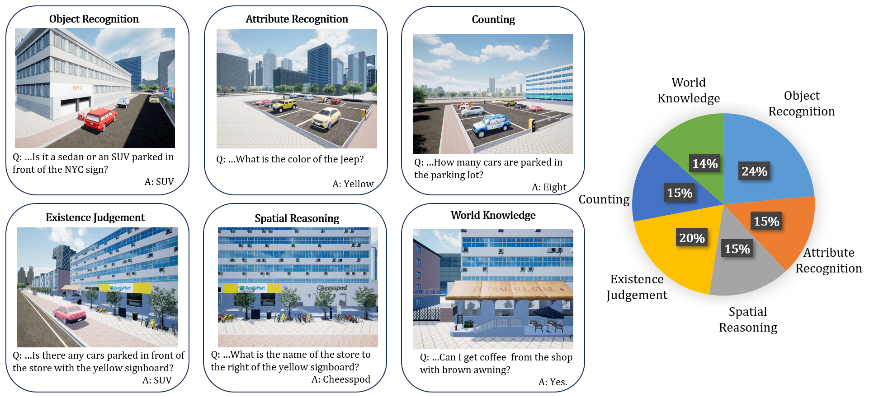

# CityEQA: A Hierarchical LLM Agent on Embodied Question Answering Benchmark in City Space

</div>

## News

**We are currently organizing the code for CityEQA. If you are interested in our work, please star ⭐ our project.**

- **(2025/02/17)** Code and CityEQA-EC dataset are released!


## An example of our CityEQA task and the typical workflow of the proposed PMA agent
<p align="center">
  
</p>


### CityEQA-EC dataset
<p align="center">
  
</p>

### Overview of the PMA agent
<p align="center">
  
</p>

### Directory Structure:

```
.
├── README.md
├── main_NE  # The Navigation and Exploration process
├── main_C  # The Collection process
├── Agent
│   ├── All agent modules of CityEQA.
├── Data
│   ├── The CityEQA-EC Dataset.
├── Evaluation
│   ├── LLM-score code and prompt.
├── Utils
│   ├── utils and arguments files.


```
### The installation and usage instructions for our code will be updated shortly.

